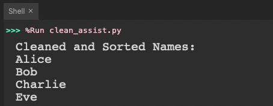

Project Level 1: Beginner

This project is designed for beginner learners who are still learning and practicing Python fundamentals.

Project Description
For this project, you are provided with the following messy list of strings that represent names:

```
messy_names = [
    "  alice ", "Bob", " charlie", "Alice", "BOB ", "eve  ", " Eve", "eve"]
```

Please place that list on top of your Python script. As you can see, some names are in lowercase letters, some have extra spaces, and others are duplicates.

Write a program that cleans the data by removing extra spaces, converting all names to title case, and removing any duplicates. Finally, display the cleaned list in alphabetical order.

Expected Output

Your task is to write a program that cleans the data by removing extra spaces, converting all names to title case (e.g., Alice), and removing any duplicates. Finally, display the cleaned list in alphabetical order.

Here is what the output of your program should be:
<p align="center">
  
</p>

Why This Project Matters in the Real World

This beginner-friendly example of cleaning up a list of names introduces you to a process that's crucial in many real-world applications. For example, in cybersecurity, you might work with a list of IP addresses and need to remove duplicates before running a network scan. Similarly, in software development, you may need to clean user inputs from a form, such as email addresses or file paths, to ensure the data is ready for processing. For instance, in Python, cleaning file paths might look like this:

```
file_paths = ["C:\\temp\\file1.txt", "C:\\temp\\file1.txt", "D:\\data\\file2.txt"]
cleaned_paths = list(set(file_paths))
```

This example mirrors the concepts you’ve just practiced but applies them to more practical scenarios, showing how foundational skills like these can be the building blocks for solving real-world problems.

Prerequisites

Required Libraries: No libraries are needed.
Required Files: No files are needed for this project.
IDE: You can use any IDE on your computer to code the project.